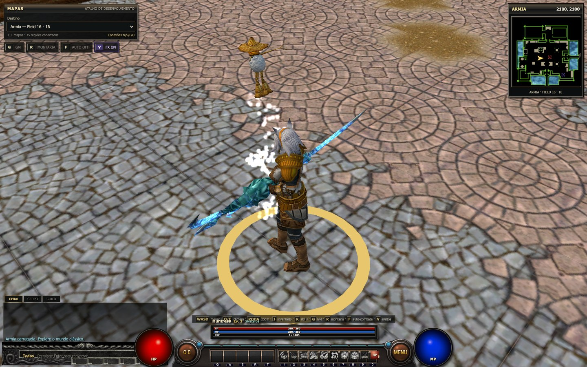
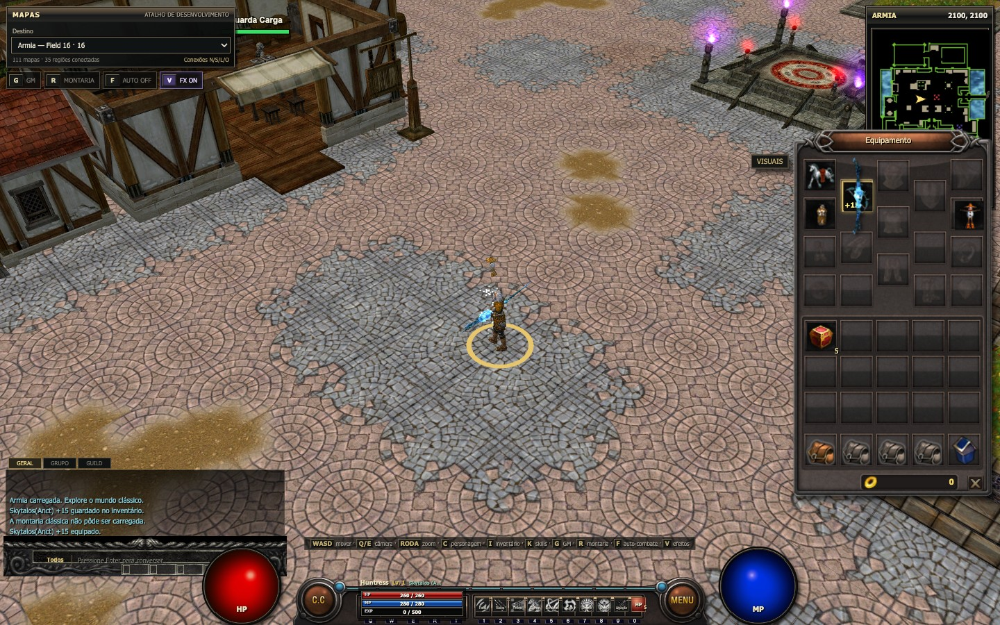
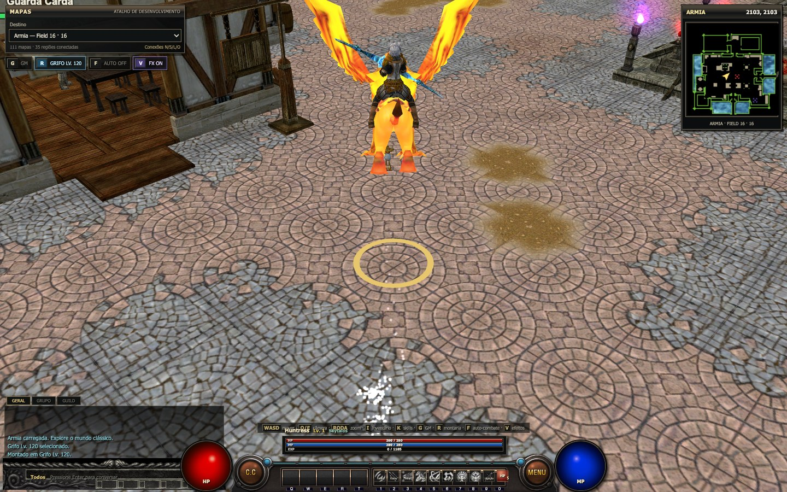
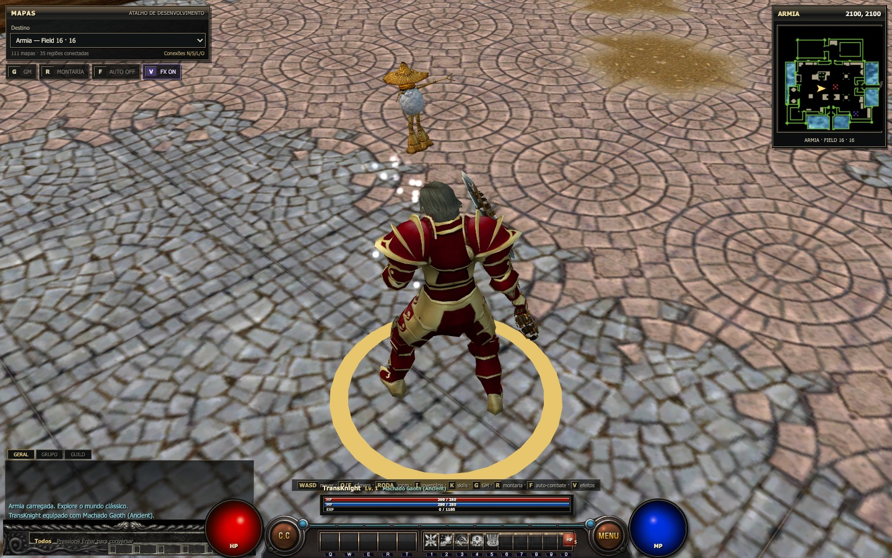
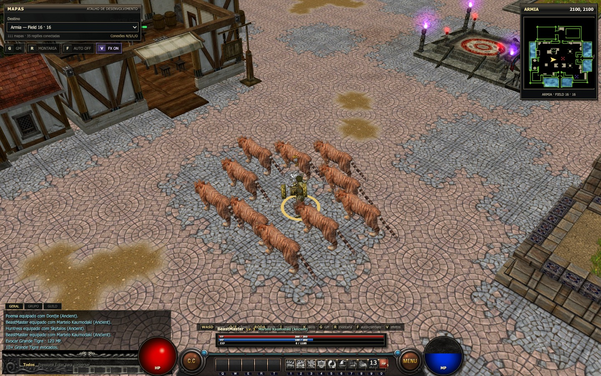
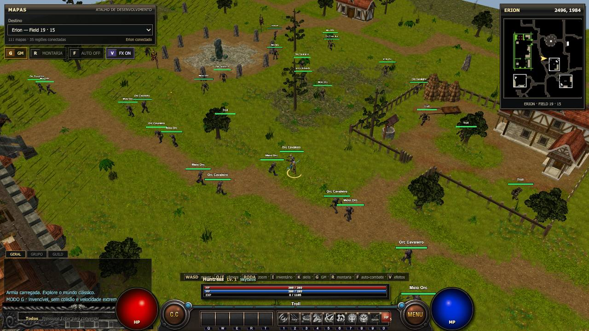
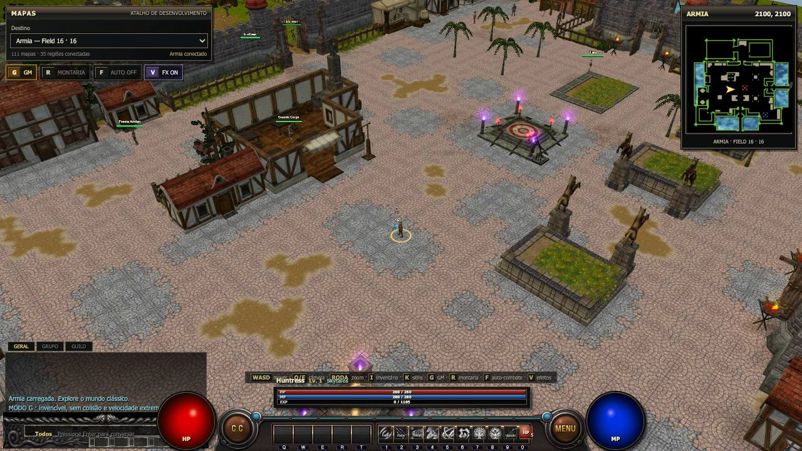

# WYD Web

Reimplementación del cliente clásico de **With Your Destiny** para el navegador,
escrita desde cero en TypeScript y Three.js. El cliente clásico/decompilado es usado
como referencia de formatos y comportamiento; el código web antiguo no es
reutilizado.

> La implementación del corte offline está cerrada. Red, persistencia y reglas
> autoritativas serán la siguiente etapa; las verificaciones visuales que requieren
> navegador/dispositivo están en el
> [checklist de homologación manual](docs/checklist-homologacao-manual.md).

Documentación de arquitectura:

- [Auditoría Three.js y cobertura clásica](docs/auditoria-threejs-cobertura.md)
- [Checklist de homologación manual](docs/checklist-homologacao-manual.md)
- [Guía del futuro servidor multiplayer](docs/guia-servidor-multiplayer.md)
- [Estimativa para reemplazar los assets clásicos](docs/estimativa-substituicao-assets.md)
- [Memoria técnica del proyecto](MEMORIA_PROJETO.md)

## Estado actual

- 111 Fields importados, nombrados, conectados y cargados dinámicamente.
- Terreno, objetos, colisión, puentes, agua, efectos ambientales y minimapa.
- TransKnight, Foema, BeastMaster y Huntress con visuales, armas y skills por clase.
- Equipo modular del jugador con 990 piezas de cuerpo/1.019 variantes y 788
  armas `Equip[6]/Equip[7]`, incluidas dos manos, garras espejadas, ANI
  a pie/montado y multitextura Ancient/refinación cuando presente en la instancia.
- Las 24 identidades/caras canónicas `Equip[0]` preservan la clase, el rig y
  `FaceMesh/FaceSkin`; los cascos siguen correctamente separados en `Equip[1]`.
- Las 36 capas `Equip[15]` usan el rig animado `mt01`, offsets por armadura y
  pose propia cuando el personaje está montado.
- Huntress con Mujer Kalintz, Skytalos Ancient +15 animado y Griupan.
- Extracción y Alquimia de la Huntress con selección de item, confirmación y panel
  `Mixlist.bin`; los resultados económicos siguen reservados al servidor.
- Toxina de Serpiente mantiene el requisito clásico de garras `WTYPE 41` y
  rechaza correctamente el Skytalos `WTYPE 101` antes de consumir mana.
- Ocho evocaciones naturales del BeastMaster (10 por uso) y las cinco
  transformaciones clásicas con rig y animaciones propios.
- 16 monturas clásicas nivel 120, incluidas Unicornio, Grifo, Caballo Ligero N y Andaluz N.
- Equipamientos visuales de los NPCs derivados de `npcdb`: armas, capas,
  monturas y Nyerdes animado con rastro aditivo instanciado.
- Efectos propios de dragones, minotauros, golems, demonios, elfos,
  jabalíes/lobos, trolls y orcs, anclados en los bones clásicos y agrupados por
  textura.
- NPCs y monstruos con animación, autonomía, separación, combate, muerte y respawn.
- Cementerio y Cabuncle con contador sincronizado para el próximo reset de 10
  minutos; los monstruos de esas quests solo adquieren al jugador dentro del área.
- Drops materializados en el mundo, recogida por proximidad y nombres globales opcionales.
- Bolsa y carga respetan el `EF_GRID` clásico para items de `1×1` hasta `2×4`.
- Movimiento por WASD/clic, cámara clásica, zoom amplio y modo G.
- C.C clásico con modos físico, mágico y soporte, arco, daño/crítico, skills y
  buffs de la Huntress.
- Maestro Carb con interacción instantánea y los estados/iconos de los 32 buffs de
  clase/master de `SkillData.bin` renovados por 15 minutos.
- HUD clásico e inventario 7.54 con cuatro bolsas, arrastrar/soltar, equipo y
  previa 3D con clic, además del catálogo de skills y selector de mapas.
- Banda sonora clásica ruteada por mapa/ciudad y catálogo lazy de 333 SFX. La música
  comienza desactivada y puede alternarse con `M`; SFX de ataque, skill, impacto,
  level up y recogida siguen independientes. Los pasos respetan el tipo de suelo;
  monstruos/NPCs usan los IDs de sus acciones en `AniSound4.txt`, y cascadas,
  lluvia local y objetos ambientales poseen loops atenuados por distancia.
- Primer acceso asistido con caché versionado de Armia, progreso en
  archivos/bytes, reanudación y fallback transparente a la red. La ciudad solo se
  revela después de que terreno, edificios, agua, efectos y jugador estén montados
  y la primera imagen ya haya sido enviada a la GPU.

## Capturas del build actual

| Armia, HUD, minimapa y selector | Huntress, Skytalos Ancient y Griupan |
| --- | --- |
|  |  |

| Inventario, trajes y monturas | Grifo nivel 120 |
| --- | --- |
|  |  |

| Buff persistente de la Huntress | Catálogo clásico de skills |
| --- | --- |
|  |  |

### Las cuatro clases clásicas

| TransKnight con Hacha Gaoth | Foema con Dordje |
| --- | --- |
|  |  |

| BeastMaster con Martillo Kaumodaki | Huntress con Skytalos |
| --- | --- |
|  |  |

### Evocaciones del BeastMaster

El slot `9` de la barra evoca al **Gran Tigre**. Al igual que las demás evocaciones
naturales del BeastMaster, cada uso crea una formación con 10 criaturas.



| Criaturas en el mundo abierto | Vista general de Armia |
| --- | --- |
|  |  |

Una captura real fue generada para cada Field disponible. Consulte la
**[galería completa de los 111 mapas](docs/screenshots/maps/README.md)**.

## Ejecutando desde cero

### Requisitos

- [Git](https://git-scm.com/).
- [Bun 1.x](https://bun.sh/docs/installation) — este proyecto no usa npm.
- Navegador de escritorio actual con WebGL 2 y aceleración de hardware habilitada.
- Aproximadamente 500 MB libres para repositorio, dependencias y build.

### 1. Clonar e instalar

```bash
git clone git@github.com:acgfbr/wyd-client.git
cd wyd-client
bun install --frozen-lockfile
```

El repositorio actual ya incluye `public/game-data/classic`. Confirme que el paquete
de datos vino en el clone:

```bash
test -f public/game-data/classic/manifest.json && echo "assets OK"
```

### 2. Iniciar el juego

```bash
bun run dev
```

Abra [http://localhost:5173](http://localhost:5173). El juego comienza en Armia, en la
coordenada `2100, 2100`. Si el puerto está ocupado, Vite mostrará en la terminal
el próximo puerto utilizado.

En el primer acceso, la pantalla inicial prepara 819 archivos esenciales de Armia
(cerca de 34,0 MiB) en el almacenamiento del navegador. El botón **Entrar ahora**
interrompe esa preparación sin bloquear el juego; el próximo acceso retoma solo
lo que esté ausente. El paquete completo de mapas permanece bajo demanda y no se
copia íntegramente. Para eliminar el paquete inicial, abra **MENÚ → Limpiar paquete
local**.

`CacheStorage` evita descargar nuevamente los archivos, pero Three.js aún necesita
decodificar modelos/texturas y enviarlos a la GPU cuando entran en el streaming. En
modo privado, con poco espacio o tras la expulsión automática de Safari/iOS, el juego
continúa por red y recompone el caché cuando sea posible. Los service workers requieren
HTTPS en producción; `localhost` es aceptado durante el desarrollo.

### 3. Validar un build de producción

```bash
bun run build
bun run preview
```

El build se escribe en `dist/`; el preview normalmente se abre en
[http://localhost:4173](http://localhost:4173).

### Protección del build web

El build de producción no publica source maps, elimina comentarios legales,
`debugger` y llamadas a `console.debug`, y aplica la minificación completa de
esbuild a identificadores, sintaxis y espacios. Los bundles generados usan solo
hashes en los nombres; `console.warn` y `console.error` permanecen disponibles para
diagnóstico de fallos reales en dispositivos y assets.

Esto dificulta la lectura casual e ingeniería inversa, pero no transforma el código
ejecutado en el navegador en un secreto: el usuario siempre recibe el JavaScript y las
reglas necesarias para ejecutar el juego. Llaves privadas, validaciones autoritativas,
economía, drops y decisiones anticheat deben permanecer en el servidor.

## Recreando los assets a partir del cliente clásico

Esta etapa es opcional cuando `public/game-data/classic` ya vino en el clone. Úsela
para reconstruir el paquete a partir de sus propios archivos del cliente:

```text
Origem/
├── Env/
├── Effect/
├── mesh/
├── UI/
├── NUI/
├── object.bin
├── ItemList.bin
├── ItemPrice.bin
├── Itemname.txt
├── SkillData.bin
└── AniSound4.txt

tools/data/
├── NPCGener.txt
└── npcdb/
```

Ejecute el importador único pasando rutas absolutas:

```bash
bun run import:all -- \
  "/ruta/a/Origem" \
  "/ruta/a/tools/data"
```

Sin argumentos, busca `../tjs/Origem` y `../tjs/tools/data`, relativos a
este repositorio:

```bash
bun run import:all
```

El comando ejecuta, en orden, los importadores de mundo/criaturas, personaje,
skills, UI, comercio y audio, y por último regenera el índice versionado del
caché inicial. Para depuración, también pueden ser llamados
por separado:

```bash
bun run import:classic -- "/ruta/a/Origem" "/ruta/a/tools/data"
bun run import:player -- "/ruta/a/Origem"
bun run import:skills -- "/ruta/a/Origem"
bun run import:ui -- "/ruta/a/Origem"
bun run import:commerce -- "/ruta/a/Origem" "/ruta/a/tools/data"
bun run import:audio -- "/ruta/a/Origem" "/ruta/a/wyd_extracted/AudioClip"
bun run import:cache
```

La segunda ruta del importador de audio es opcional y solo acepta fallback con
el mismo nombre de archivo. En el corpus actual recupera `mguardatt.wav` del
cliente mobile; aproximaciones como `weath03-A/B` no sustituyen referencias
desktop diferentes.

`import:commerce` genera
`public/game-data/classic/commerce/catalog.json` a partir de los 6.500 registros
de `ItemList.bin`, los overrides de `ItemPrice.bin` y los 27 slots comerciales
de `Carry` en las plantillas de `npcdb` referenciadas por `NPCGener.txt`. Este
catálogo es estático y de solo lectura. En este corpus, los campos finales de
`ItemList.bin` usan `unique@132`, `reserved@134`, `position@136`, `extra@138`,
`link@140` y `grade@142`; esos offsets alimentan los tooltips clásicos de
inventario/equipo/carga/tienda con requisitos, efectos fijos, tres
adicionales de instancia, refinación y bonificación Ancient. Compra, venta, saldo, Tax y
cualquier mutación de inventario siguen siendo responsabilidades del futuro
servidor.

## Controles

| Entrada | Acción |
| --- | --- |
| `WASD` / flechas | Mover el personaje |
| Clic izquierdo | Caminar hasta el punto o seleccionar un objetivo |
| Izquierdo mantenido | Actualizar continuamente el destino |
| Izquierdo + derecho | Avanzar en la dirección de la cámara |
| Derecho arrastrado | Girar la cámara |
| Rueda del ratón | Zoom de `3.5` a `180` unidades |
| `Q` / `E` | Girar la cámara con el teclado |
| `G` | Modo GM: velocidad extrema, invencibilidad y sin colisión |
| `R` | Montar/desmontar |
| `F` | Alternar C.C: desactivado → físico → mágico → soporte |
| Clic en `C.C` | Abrir/cerrar la caja clásica de configuración |
| `Espacio` | Recoger el drop materializado más cercano dentro del alcance offline ampliado |
| `Z` | Activar/desactivar los nombres de todos los drops |
| `1`–`9` | Usar skills de la barra |
| `I` | Abrir/cerrar inventario, trajes y monturas |
| Clic en un item | Fijar la previa 3D al cursor; otro clic suelta/mueve/equipa |
| Arrastrar un item | Mover/intercambiar en la bolsa o equipar/desequipar |
| Doble clic en un item | Usar consumible o equipar/desequipar |
| Pestañas de bolsa | Alternar entre las cuatro páginas de 15 espacios |
| `K` | Abrir/cerrar catálogo de skills |
| `V` | Activar/desactivar todos los efectos visuales |
| `M` | Activar/desactivar solo la música (desactivada por defecto) |
| `B` | Activar/desactivar todos los SFX: ataque, skill, buff, pasos y ambiente |

### Loot offline

Mientras no hay servidor autoritativo, el fallback local puede materializar
**Poción de HP** (`#400`), **Poción de MP** (`#405`), **Polvo de Oriharucon**
(`#412`) y **Polvo de Lactolerium** (`#413`). Las probabilidades y la tabla de
drop son mocks exclusivos del modo offline; el servidor deberá reemplazarlas.
Los cuatro items son agrupables en pilas de hasta 50 unidades: una recogida del suelo
completa primero una pila existente, y soltar una pila sobre otra en el
inventario también las combina. Para reducir fallos de aproximación, la recogida web
acepta hasta tres celdas y busca un punto caminable alrededor del item, manteniendo
la validación de colisión y altura para no atravesar paredes o suelos de puentes.

### Caja C.C

El clic en el botón redondo `C.C` solo abre o cierra la caja original de
`120×30`; el primer icono alterna el modo. Los otros tres controles ajustan la
recuperación automática de HP/MP, el límite reservado a la montura y la política de
movimiento (continua, posición fija o parada). Los iconos son recortes reales del
atlas clásico `main.wyt` importado como `main.png`.

- Físico busca hostiles cercanos y usa el ataque básico.
- Mágico usa solo las skills ofensivas seleccionadas en la extensión de la caja,
  respetando el orden, mana, cooldown y alcance, sin caer en ataque básico.
- Soporte mantiene buffs/evocaciones y recuperación, sin atacar.
- `F` altera el mismo estado mostrado en la caja; no abre la interfaz.

El porcentaje de la montura ya es configurable, pero aún no alimenta una regla
local porque HP y ración de la montura pertenecen al futuro estado autoritativo del
servidor.

## Deploy en Vercel con `public/game-data`

Vite copia automáticamente `public/game-data` a `dist/game-data`. Como los
assets ya están versionados, el camino recomendado es el deploy por la integración
Git de Vercel:

1. Envíe el repositorio a GitHub/GitLab/Bitbucket.
2. En Vercel, elija **Add New → Project** e importe el repositorio.
3. Mantenga el preset **Vite**. El [`vercel.json`](vercel.json) ya configura:
   `bun install --frozen-lockfile`, `bun run build` y salida `dist`.
4. Haga clic en **Deploy** y valide `/game-data/classic/manifest.json` en la URL
   publicada antes de abrir el juego.

El paquete actual posee cerca de 264 MB después de la importación de las músicas y SFX
clásicos. En el plan Hobby, Vercel limita los uploads
de archivos fuente hechos por la CLI a 100 MB; por eso, prefiera la integración Git
para este repositorio. El límite documentado y los demás límites actuales están en la
[documentación oficial de Vercel](https://vercel.com/docs/limits). Si en el futuro
los assets son migrados a Git LFS, habilite **Git LFS** en *Project Settings
→ Git* antes de hacer un nuevo deploy; Vercel posee
[soporte oficial a LFS](https://vercel.com/docs/project-configuration/git-settings#git-large-file-storage-lfs).

Los assets clásicos pueden estar sujetos a los derechos de los respectivos
propietarios. Antes de publicar un repositorio o deployment abierto, confirme
que tiene autorización para distribuirlos.

## Problemas comunes

| Síntoma | Corrección |
| --- | --- |
| `Assets no importados` | Confirme `public/game-data/classic/manifest.json` o ejecute `bun run import:all`. |
| Personaje se convierte en cápsula / traje o montura ausentes | Ejecute `bun run import:player`. |
| HUD sin imágenes | Ejecute `bun run import:ui`. |
| Menú de skills pide importación | Ejecute `bun run import:skills`. |
| Juego sin música/SFX | Ejecute `bun run import:audio`; la reproducción comienza tras clic/toque/tecla debido a la política de autoplay. |
| `NPCGener.txt` o `npcdb` ausentes | Corrija la segunda ruta pasada a `import:all`. |
| Error de nombre de archivo en Linux | Preserve exactamente las carpetas `Env`, `Effect`, `UI`, `NUI` y `mesh`. |
| Pantalla negra o error WebGL | Actualice el navegador/driver y habilite la aceleración de hardware. |
| Vercel publica la app, pero assets retornan 404 | Confirme que `public/game-data` está versionado y que `manifest.json` existe en el deployment. |
| La primera carga reinicia o usa la red | Evite el modo privado, verifique el espacio libre y mantenga la pestaña abierta; una preparación interrumpida se reanuda en el próximo acceso. Safari/iOS puede expulsar el caché bajo presión. |
| La pantalla se queda en “Montando…” incluso con el caché listo | El caché evita la red, pero el navegador aún necesita decodificar modelos/texturas y montar la primera escena. Armia solo se revela cuando esta etapa termina. |
| Modifiqué/importé assets, pero el caché antiguo continúa | Ejecute `bun run import:cache`, genere un nuevo build y publique también `precache-armia.json`. |

## Estructura principal

```text
src/app/                 orquestación del juego
src/assets/              fuente y manifiesto de los assets importados
src/formats/classic/     parsers de los formatos clásicos
src/game/                jugador, combate, criaturas, monturas y estado
src/render/              terreno, modelos, agua y efectos
src/world/               Fields, streaming, coordenadas y navegación
src/ui/                  HUD y minimapa
tools/                   importadores del cliente clásico
public/game-data/        paquete web generado/versionado
docs/screenshots/        capturas reales usadas en la documentación
```

Más detalles están en [docs/architecture.md](docs/architecture.md).
